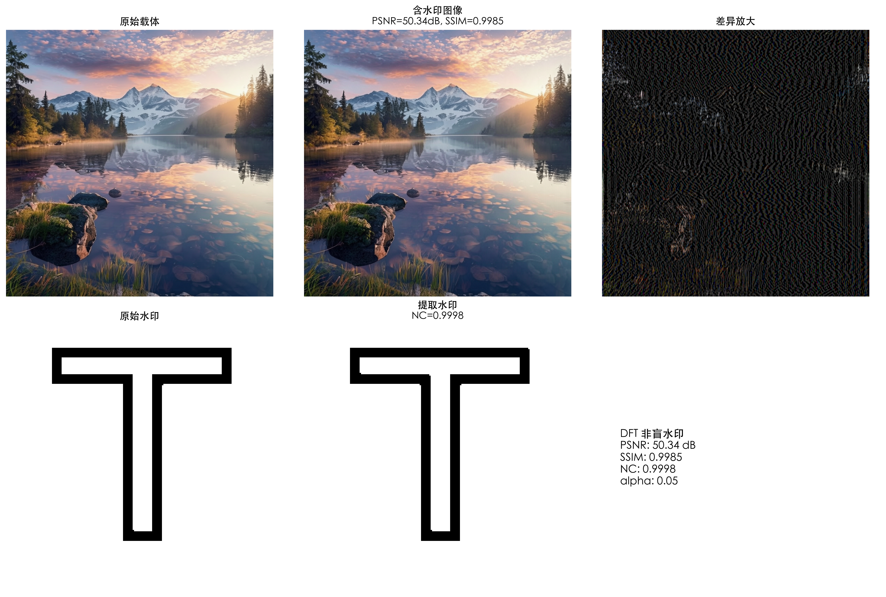
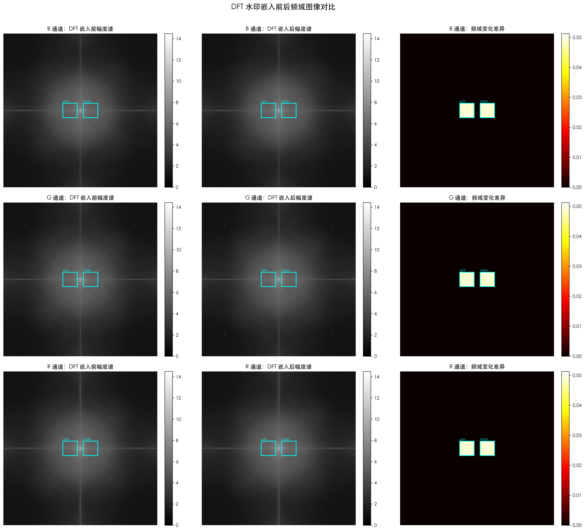
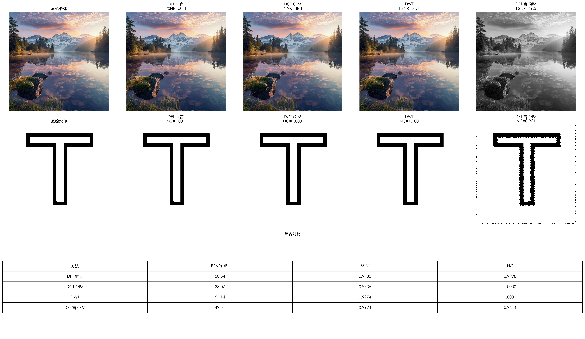

# 图像频域数字水印

本项目是“信号与系统”课程大作业，实现了多种图像频域水印嵌入方案，并提供可双击运行的桌面程序、网页界面和完整实验脚本。

桌面程序适合直接生成含水印图片。实验脚本用于分析水印质量、鲁棒性，并对比 DFT、DCT 和 DWT 水印方案。

## 功能概览

### 桌面程序

- 上传载体图片和水印图片。
- 自动将水印缩放并二值化。
- 选择 DFT、DCT QIM 或 Haar DWT 算法嵌入水印。
- 调整嵌入强度 `alpha`。
- 展示含水印图片、PSNR 和 SSIM。
- 下载生成的 PNG 图片。
- 双击运行后自动打开浏览器，无需手动输入地址。

### 实验脚本

- DFT 非盲水印嵌入与提取。
- 生成 B、G、R 三通道的 DFT 嵌入前后幅度谱和频域差异图。
- 扫描不同 `alpha` 对 PSNR、SSIM 和 NC 的影响。
- 测试 JPEG 压缩、缩放和高斯噪声攻击下的鲁棒性。
- 对比 DFT 非盲、DCT QIM、DWT 和 DFT 盲 QIM 方法。
- 自动生成实验图表和终端报告。

## 快速开始

### 直接运行桌面程序

项目已经在 macOS 上生成可执行程序：

```text
dist/图像频域水印.app
```

双击应用后，系统会自动打开浏览器页面。上传载体图片和水印图片，选择算法，调整嵌入强度，然后点击“生成含水印图片”。

使用结束后，点击页面左侧的“退出应用”。

生成文件保存在：

```text
~/.frequency_watermark/web_outputs/
```

### 以开发模式运行网页端

安装网页端依赖：

```bash
python3 -m pip install -r requirements-web.txt
```

启动程序：

```bash
python3 app.py
```

程序会自动打开浏览器，也会在终端中打印本机访问地址，例如：

```text
http://127.0.0.1:62033
```

程序仅监听本机地址，不会对局域网或互联网开放服务。

## 打包桌面程序

安装运行依赖和 PyInstaller：

```bash
python3 -m pip install -r requirements-build.txt
```

执行打包脚本：

```bash
python3 build_desktop.py
```

产物位于 `dist/` 目录：

| 操作系统 | 生成文件 |
| --- | --- |
| macOS | `dist/图像频域水印.app` |
| Windows | `dist/图像频域水印.exe` |
| Linux | `dist/图像频域水印` |

PyInstaller 只能为当前操作系统生成程序。例如，Windows `.exe` 需要在 Windows 电脑上执行打包命令，不能直接在 macOS 上生成。

## 运行完整实验

实验脚本和桌面程序的用途不同。桌面程序使用轻量依赖，实验脚本还需要 OpenCV、Matplotlib 和 scikit-image。

安装实验依赖：

```bash
python3 -m pip install numpy opencv-python matplotlib scikit-image
```

确认项目根目录中存在：

```text
input.png
watermark.png
```

运行实验：

```bash
python3 dft_image_processor_show_dwt_fixed.py
```

脚本会在项目根目录生成实验图表，并在终端中输出各方案的 PSNR、SSIM 和 NC。

## 算法说明

### 应用内置算法

| 算法 | 应用中的名称 | 说明 |
| --- | --- | --- |
| DFT | `DFT 频域嵌入` | 在傅里叶频谱的对称区域嵌入水印，是默认方案。 |
| DCT QIM | `DCT QIM 分块嵌入` | 将图像划分为 `8 x 8` 块，在中频系数中进行量化索引调制。 |
| Haar DWT | `Haar DWT 小波嵌入` | 在 Haar 小波变换的细节分量中嵌入水印。 |

### DFT 水印嵌入

桌面程序对 RGB 三个通道分别执行二维 DFT，并通过 `fftshift` 将低频区域移动到频谱中心。水印经过灰度化、缩放和二值化后，转换为 `-1` 和 `1` 的矩阵。

程序在频谱中心附近选取水印区域，根据原始频域系数的幅值和相位加入水印信号。为了保持实值图像所需的共轭对称性，程序同时在对称区域嵌入翻转后的水印。最后执行逆 DFT，并将像素值限制在有效范围内。

嵌入强度由 `alpha` 控制：

- 较小的 `alpha`：图像失真更低，但水印信号更弱。
- 较大的 `alpha`：水印信号更明显，但可能降低视觉质量。

### 评价指标

| 指标 | 含义 |
| --- | --- |
| PSNR | 峰值信噪比，用于衡量含水印图像与原图的差异。数值通常越高越好。 |
| SSIM | 结构相似度，用于衡量两幅图像的结构相似程度。越接近 `1` 越好。 |
| NC | 归一化相关系数，用于衡量提取水印与原始水印的相似程度。越接近 `1` 越好。 |

桌面端显示 PSNR 和 SSIM。完整实验脚本还会在提取水印后计算 NC。

## 在应用中新增算法

网页端通过 `app.py` 中的统一入口调用不同算法。新增算法时，通常只需要修改后端注册表、嵌入函数和页面说明。

1. 在 `app.py` 的 `METHODS` 中注册方法名称：

```python
METHODS = {
    "dft": "DFT 频域嵌入",
    "dct": "DCT QIM 分块嵌入",
    "dwt": "Haar DWT 小波嵌入",
    "new_method": "新水印算法",
}
```

2. 实现统一形式的嵌入函数。输入图片和返回图片都应为 `0` 到 `1` 范围内的 RGB NumPy 数组：

```python
def new_method_embed(
    cover: np.ndarray,
    wm_bin: np.ndarray,
    wm_pm1: np.ndarray,
    alpha: float,
) -> np.ndarray:
    ...
    return watermarked
```

3. 在 `embed_watermark()` 中添加分发逻辑：

```python
if method == "new_method":
    return new_method_embed(cover, wm_bin, wm_pm1, alpha)
```

4. 在 `templates/index.html` 的 `hints` 中补充页面提示文本。

如果新方法需要额外第三方库，还要将依赖加入 `requirements-web.txt`，并重新执行 `python3 build_desktop.py`。桌面端优先使用 NumPy 和 Pillow 实现，以控制可执行程序体积。

## 实验输出

| 文件 | 内容 |
| --- | --- |
| `basic_dft_result.png` | DFT 非盲水印的嵌入、差异放大和提取结果 |
| `frequency_diff.png` | 水印嵌入前后的频谱差异 |
| `frequency_comparison.png` | B、G、R 三通道的 DFT 嵌入前幅度谱、嵌入后幅度谱和频域变化差异 |
| `alpha_scan.png` | 不同 `alpha` 下 PSNR、SSIM 和 NC 的变化 |
| `robustness_summary.png` | JPEG、缩放和高斯噪声攻击下的鲁棒性 |
| `method_comparison.png` | DFT 非盲、DCT QIM、DWT 和 DFT 盲 QIM 综合对比 |

### DFT 基础结果



### DFT 频谱对比



### 方法对比



## 项目结构

```text
.
├── app.py                              # 桌面程序和 Flask 网页后端
├── build_desktop.py                    # PyInstaller 跨平台打包脚本
├── dft_image_processor_show_dwt_fixed.py # 完整实验脚本
├── templates/
│   └── index.html                      # 网页模板
├── static/
│   └── styles.css                      # 页面样式
├── requirements-web.txt                # 桌面程序和网页端依赖
├── requirements-build.txt              # 桌面打包依赖
├── input.png                           # 实验载体图片
├── watermark.png                       # 实验水印图片
├── input_base.png                      # 网页端测试用载体图片
├── watermark_base.png                  # 网页端测试用水印图片
├── README_web.md                       # 网页端简版说明
└── 信号与系统 大作业说明.pptx          # 课程作业说明
```

`build/`、`dist/`、`.pyinstaller-cache/` 和 `*.spec` 都是打包过程生成的文件，不需要手动维护。

## 参数调整

完整实验脚本中的主要参数位于 `dft_image_processor_show_dwt_fixed.py` 顶部：

```python
ALPHA = 0.05
DCT_DELTA = 36
DFT_QIM_DELTA = 50.0
```

- `ALPHA`：DFT 非盲水印嵌入强度。
- `DCT_DELTA`：DCT QIM 量化步长。
- `DFT_QIM_DELTA`：DFT 盲 QIM 量化步长。

桌面程序可以直接通过页面滑块调整 `alpha`，默认值为 `0.05`。

## 注意事项

- 网页端支持 PNG、JPG、JPEG、BMP 和 WEBP 图片，单次上传总大小限制为 `16 MB`。
- 完整实验中的 DFT 提取属于非盲提取，需要原始载体图片。
- Windows 用户需要在 Windows 环境下重新执行打包脚本，才能获得 `.exe` 文件。
- macOS 首次打开未经过 Apple 公证的本地应用时，系统可能要求在“系统设置 > 隐私与安全性”中确认打开。
